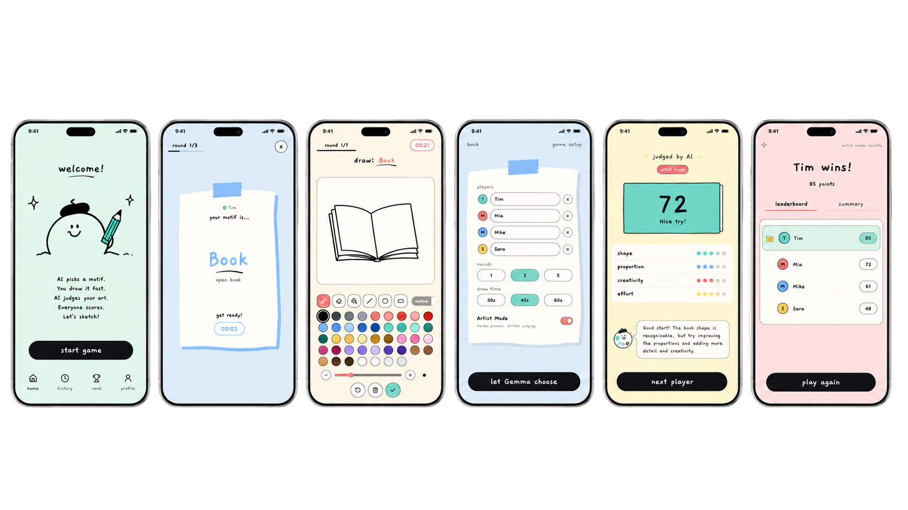

<p align="center">
  
</p>

<p align="center">
  
  
  
  
  
  
  
  
</p>

<h1 align="center">Sketch Judge</h1>

<p align="center">
  <strong>Draw fast. Match right. AI decides.</strong>
</p>

<p align="center">
  A mobile-first AI drawing game prototype where Gemma chooses the motif, players sketch against the clock, and AI judges how well each drawing matches the target.
</p>

<p align="center">
  <a href="https://sketch-judge.vercel.app/">Live frontend preview</a>
  ·
  <a href="https://github.com/southy404/sketch-judge">Repository</a>
</p>

<p align="center">
  
</p>

---

## What is Sketch Judge?

Sketch Judge is a playful AI drawing game prototype for kids, adults, and artists.

The game loop is simple:

1. Add players.
2. Choose rounds and draw time.
3. Let Gemma choose a motif.
4. Reveal the motif to the current player.
5. Draw before the timer ends.
6. Let the AI judge the drawing.
7. Compare everyone in the final leaderboard.

The goal is not only to draw something beautiful. The goal is to draw something that clearly matches the motif.

If the target is **book**, drawing a beautiful apple should not win.

---

## Current Status

Sketch Judge now supports two runtime paths:

### Local development

Local development uses:

- Vite frontend
- local Express API server
- Ollama
- `gemma4:e4b`

This is the main local-first prototype path.

### Hosted Vercel preview

The hosted deployment uses:

- Vite static frontend
- Vercel API routes
- OpenRouter as hosted AI provider

Vercel serverless functions cannot access a user's local Ollama instance. Because of that, the deployed version should use OpenRouter while the local version can keep using Ollama.

Live preview:

```txt
https://sketch-judge.vercel.app/
```

---

## Why Gemma 4?

Sketch Judge was built for the **Gemma 4 Challenge**.

Gemma is used as the core game brain:

- choosing fresh drawing motifs,
- creating harder Artist Mode prompts,
- judging sketches against the target motif,
- returning scores, category ratings, and feedback,
- powering the local-first prototype through Ollama,
- supporting hosted tests through OpenRouter.

The local prototype uses:

```txt
gemma4:e4b
```

This model choice was intentional. The project is mobile-first and points toward a future where this type of small AI game could run closer to the user's own device.

For hosted OpenRouter deployments, model IDs are different from Ollama tags. The local Ollama model name `gemma4:e4b` is not an OpenRouter model ID.

Recommended hosted OpenRouter model:

```txt
google/gemma-4-26b-a4b-it
```

---

## Modes

### Casual Mode

Casual Mode is forgiving and family-friendly.  
A simple but recognizable drawing can score well.

### Artist Mode

Artist Mode is stricter and aimed at adults, artists, and competitive players.  
It prefers harder motifs and judges detail, proportion, creativity, color, polish, and effort more seriously.

A simple outline can still be recognized, but it should not beat a detailed, colorful, polished drawing.

---

## Features

- Mobile-first game UI
- Tablet, iPad, desktop, and orientation-responsive layouts
- Dynamic browser theme color per screen
- React + TypeScript + Vite frontend
- Node/Express local API server
- Vercel API routes for hosted deployment
- AI provider abstraction for Ollama and OpenRouter
- Local Ollama integration for `gemma4:e4b`
- OpenRouter integration for hosted AI calls
- Gemma-powered motif generation
- AI judging with score, category dots, and feedback
- Casual Mode and stricter Artist Mode
- Round-based multiplayer flow
- Draw handling for equal final scores
- Recent motif memory to reduce repetition
- Fallback motif and score logic when AI output is unavailable
- Pastel sketchbook visual style
- Paper/tape UI assets and responsive note cards
- Canvas drawing tools: brush, eraser, fill, line, circle, rectangle, color palette, brush size, opacity, undo, clear
- Final leaderboard and round summaries

---

## Tech Stack

| Layer           | Tech                                       |
| --------------- | ------------------------------------------ |
| Frontend        | React                                      |
| Language        | TypeScript                                 |
| Build Tool      | Vite                                       |
| Canvas          | HTML Canvas                                |
| Local API       | Node.js + Express                          |
| Hosted API      | Vercel API Routes                          |
| AI Providers    | Ollama / OpenRouter                        |
| Local Model     | `gemma4:e4b` via Ollama                    |
| Hosted Model    | `google/gemma-4-26b-a4b-it` via OpenRouter |
| Dev Runner      | tsx                                        |
| Package Manager | pnpm                                       |

---

## Local Setup

### 1. Install dependencies

```bash
pnpm install
```

### 2. Create local environment file

Create `.env` from `.env.example`.

```bash
cp .env.example .env
```

On Windows PowerShell:

```powershell
Copy-Item .env.example .env
```

### 3. Start Ollama

Make sure Ollama is running locally:

```bash
ollama serve
```

Run the model used by the local prototype:

```bash
ollama run gemma4:e4b
```

If your local model name is different, update:

```txt
OLLAMA_MODEL=your-model-name
```

### 4. Start the app

```bash
pnpm dev
```

This starts both:

- Vite frontend
- local Express API server

Default local API:

```txt
http://127.0.0.1:8789
```

---

## Available Scripts

```bash
pnpm dev
```

Start frontend and local API together.

```bash
pnpm dev:phone
```

Start the app on `0.0.0.0` so it can be tested from a phone or tablet on the same network.

```bash
pnpm dev:web
```

Start only the Vite frontend.

```bash
pnpm dev:api
```

Start only the local API server.

```bash
pnpm build
```

Run TypeScript checks and create the Vite production build.

```bash
pnpm preview
```

Preview the production build locally.

---

## AI Providers

Sketch Judge calls its own backend with relative URLs:

```txt
/api/motif
/api/judge
/api/health
```

The browser never calls OpenRouter directly and never receives `OPENROUTER_API_KEY`.

### Local Ollama mode

Use this for local development:

```txt
AI_PROVIDER=ollama
AI_FALLBACK_PROVIDER=ollama

OLLAMA_BASE_URL=http://127.0.0.1:11434
OLLAMA_MODEL=gemma4:e4b
```

### Hosted OpenRouter mode

Use this for Vercel:

```txt
AI_PROVIDER=openrouter
AI_FALLBACK_PROVIDER=openrouter

OPENROUTER_API_KEY=your-openrouter-key
OPENROUTER_MODEL=google/gemma-4-26b-a4b-it
OPENROUTER_BASE_URL=https://openrouter.ai/api/v1
OPENROUTER_SITE_URL=https://sketch-judge.vercel.app
OPENROUTER_APP_NAME=Sketch Judge
```

### Provider behavior

- Local default: Ollama
- Vercel default: OpenRouter
- If OpenRouter is not configured, `/api/health` should make that visible.
- If an AI call fails, the app should fall back to deterministic motif/scoring logic where possible.
- On Vercel, Ollama fallback should not be attempted because `127.0.0.1` would point to the Vercel function environment, not the user's computer.

---

## Environment Variables

Example `.env`:

```txt
AI_PROVIDER=ollama
AI_FALLBACK_PROVIDER=ollama

OLLAMA_BASE_URL=http://127.0.0.1:11434
OLLAMA_MODEL=gemma4:e4b

OPENROUTER_API_KEY=
OPENROUTER_MODEL=google/gemma-4-26b-a4b-it
OPENROUTER_BASE_URL=https://openrouter.ai/api/v1
OPENROUTER_SITE_URL=https://sketch-judge.vercel.app
OPENROUTER_APP_NAME=Sketch Judge

PORT=8789
```

Never commit real `.env` files.  
Only `.env.example` should be committed.

---

## Vercel Deployment

The project includes Vercel API routes in the root `api/` folder:

```txt
api/
├── health.ts
├── motif.ts
└── judge.ts
```

These routes replace the local Express server in production:

```txt
POST /api/motif
POST /api/judge
GET  /api/health
```

Set these variables in:

```txt
Vercel Project → Settings → Environment Variables
```

Production values:

```txt
AI_PROVIDER=openrouter
AI_FALLBACK_PROVIDER=openrouter
OPENROUTER_API_KEY=your-openrouter-key
OPENROUTER_MODEL=google/gemma-4-26b-a4b-it
OPENROUTER_SITE_URL=https://sketch-judge.vercel.app
OPENROUTER_APP_NAME=Sketch Judge
```

After changing Vercel environment variables, redeploy the project.

### Health check

After deployment, open:

```txt
https://sketch-judge.vercel.app/api/health
```

Expected fields:

```json
{
  "ok": true,
  "runtime": "vercel",
  "primaryProvider": "openrouter",
  "fallbackProvider": "openrouter",
  "openRouterConfigured": true,
  "openRouterModel": "google/gemma-4-26b-a4b-it"
}
```

Do not expose secrets in this endpoint.

---

## Vercel + TypeScript ESM Notes

This project uses:

```json
{
  "type": "module"
}
```

Because Vercel runs API routes in Node ESM mode, backend/serverless relative imports must use `.js` extensions even when the source files are `.ts`.

Correct:

```ts
import { createMotifResponse } from "../server/apiHandlers.js";
import { getAiConfig } from "./ai/config.js";
import type { AiMessage } from "./ai/types.js";
```

Incorrect:

```ts
import { createMotifResponse } from "../server/apiHandlers";
import { getAiConfig } from "./ai/config";
import type { AiMessage } from "./ai/types";
```

This applies to:

- `api/*.ts`
- `server/**/*.ts`
- any `src/**/*.ts` files imported by server-side code

If Vercel logs `ERR_MODULE_NOT_FOUND`, check for a relative import missing `.js`.

---

## Project Structure

```txt
.
├── public/
│   ├── sketch-judge-logo.svg
│   ├── mockup.png
│   └── ...
│
├── api/
│   ├── health.ts             # Vercel GET /api/health
│   ├── motif.ts              # Vercel POST /api/motif
│   └── judge.ts              # Vercel POST /api/judge
│
├── server/
│   ├── ai/                   # Provider config, OpenRouter, Ollama abstraction
│   ├── apiHandlers.ts        # Shared motif + judge logic for Express and Vercel
│   ├── index.ts              # Local Express API wrapper
│   ├── motifs.ts             # Casual/artist motif pools and fallback picking
│   ├── motifValidation.ts    # Motif safety, boring/recent checks
│   ├── judgeScoring.ts       # Score guards, artist mode caps, self-tests
│   └── loadLocalEnv.ts       # Local .env loading helper
│
├── src/
│   ├── components/           # Game screens and UI components
│   ├── drawing/              # Canvas drawing engine, image stats, tools
│   ├── api.ts                # Frontend API client
│   ├── App.tsx               # Main game state machine
│   ├── gameLogic.ts          # Rounds, players, flow helpers
│   ├── scoring.ts            # Frontend score labels
│   ├── storage.ts            # Local persistence
│   ├── themeColor.ts         # Dynamic mobile browser theme color
│   ├── types.ts              # Shared frontend types
│   └── styles.css            # App styling
│
├── .env.example
├── .env.local.example
├── .gitignore
├── package.json
├── pnpm-lock.yaml
├── tsconfig.json
├── vite.config.ts
├── LICENSE
├── NOTICE
└── README.md
```

---

## Local API Test

Motif test:

```bash
curl -X POST http://127.0.0.1:8789/api/motif \
  -H "Content-Type: application/json" \
  -d '{"round":1,"totalRounds":3,"players":["Player 1","Player 2"],"recentMotifs":[],"artistMode":false,"language":"en"}'
```

Health test:

```bash
curl http://127.0.0.1:8789/api/health
```

Browser/Vercel health test:

```txt
https://sketch-judge.vercel.app/api/health
```

---

## Challenge Submission Notes

Sketch Judge was created as a **Build with Gemma 4** submission.

The project focuses on:

- meaningful Gemma usage as a game judge,
- local-first AI through Ollama,
- hosted provider support through OpenRouter,
- mobile-first design,
- tablet and desktop responsive gameplay,
- playful interaction for young and older players,
- a path toward future on-device AI gameplay.

---

## License

The source code is licensed under the **Apache License 2.0**.

```txt
Copyright © 2026 Southy404
```

Branding assets, app icons, mascots, screenshots, mockups, logos, and visual identity elements are not included in the Apache-2.0 license unless explicitly stated otherwise.

---

## Credits

Created by **Southy404**.

Built for the **Gemma 4 Challenge**.
